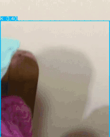
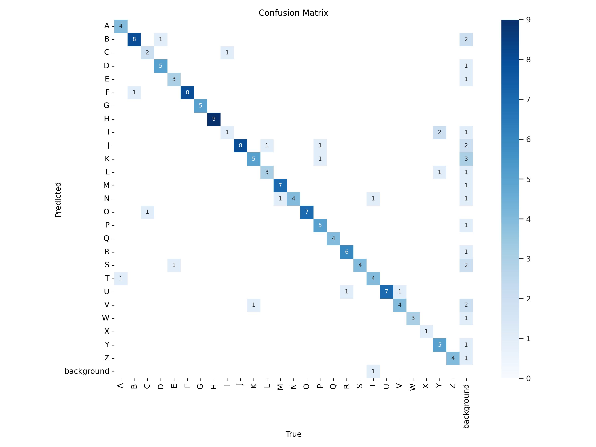
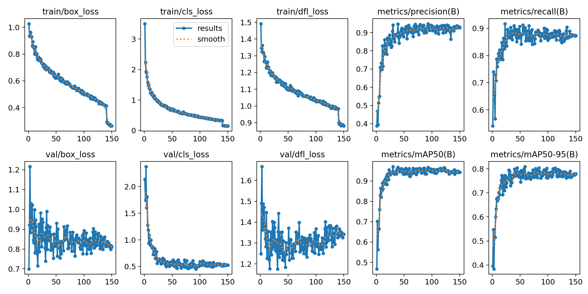

# American Sign Language (ASL) Detection Using YOLO-V11

> **"أما بعد، فإن خير الحديث كتاب الله، وخير الهديِ هديُ محمد، وشر الأمور محدَثاتها، وكل بدعة ضلالة"**

---

## **Objective**

This project aims to create a **real-time ASL detector** to assist with certain tasks by identifying and interpreting hand gestures in videos. While not designed for professional applications, this project serves as a foundational step toward leveraging computer vision for accessible communication.

---

## **Methodology**

1. **Model**: YOLO-V11 (Large Model)

   - Selected for its cutting-edge performance in object detection tasks.

2. **Training Details**:

   - **Epochs**: 150
   - **Batch Size**: 16
   - **Image Size**: 640 × 640
   - **Classes**: 26 (One for each ASL alphabet)
   - **Tracking**: Bounding Box

3. **Dataset**:

   - [Sign Language Dataset for YOLO](https://www.kaggle.com/datasets/daskoushik/sign-language-dataset-for-yolov7)

4. **Evaluation Metrics**:

   - **Confusion Matrix**: Provides insight into classification accuracy across classes.
   - **Performance Plots**: Tracks precision, recall, and mAP over training epochs.

5. **Output**:
   - Real-time detection of ASL gestures.
   - Visualized predictions with bounding boxes and class labels.
   - Evaluation graphs for precision and recall.

---

## **Project Outputs**

### **Confusion Matrix**

### **Training Results**

---

## **Resources**

1. **Dataset**:  
   Download the training data from Kaggle: [Sign Language Dataset for YOLO](https://www.kaggle.com/datasets/daskoushik/sign-language-dataset-for-yolov7)

2. **YOLO Documentation**:  
   Learn more about the YOLO-V11 model: [YOLO-V11 Docs](https://docs.ultralytics.com/ar/models/yolo11/)

---

## **Next Steps**

To make the project even more comprehensive:

1. **Data Augmentation**: Apply techniques like rotation, scaling, and lighting changes to improve robustness.
2. **Hyperparameter Tuning**: Optimize parameters such as learning rate, momentum, and IoU thresholds.
3. **Real-Time Application**: Integrate the model into a live video pipeline using OpenCV or similar libraries.
4. **Deployment**: Host the model on edge devices or cloud services for practical use.
5. **Feedback Loop**: Incorporate user feedback for iterative improvements.

---

## **Prayers for Success**

> **اللهم بارك لي في وقتي وأصلح لي شأني ولا تكلني إلى نفسي طرفة عين**  
> **اللَّهُمَّ إِنِّى أَعُوذُ بِكَ مِنَ الْعَجْزِ وَالْكَسَلِ، وَالْجُبْنِ وَالْبُخْلِ، وَالْهَرَمِ وَعَذَابِ الْقَبْرِ، اللَّهُمَّ آتِ نَفْسِى تَقْوَاهَا، وَزَكِّهَا أَنْتَ خَيْرُ مَنْ زَكَّاهَا، أَنْتَ وَلِيُّهَا وَمَوْلاَهَا، اللَّهُمَّ إِنِّى أَعُوذُ بِكَ مِنْ عِلْمٍ لاَ يَنْفَعُ، وَمِنْ قَلْبٍ لاَ يَخْشَعُ، وَمِنْ نَفْسٍ لاَ تَشْبَعُ، وَمِنْ دَعْوَةٍ لاَ يُسْتَجَابُ لَهَا**
